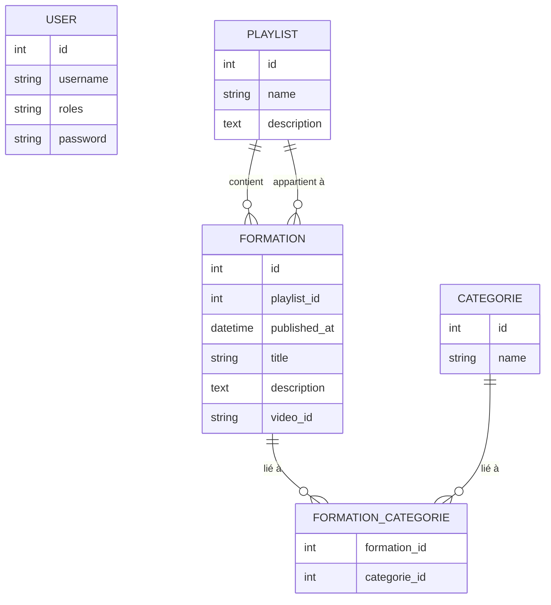

# Mediatekformation

## Présentation

Mediatekformation est une application Symfony 6.4 qui met à disposition, pour une chaîne de médiathèques, des vidéos d’auto‑formation publiées sur YouTube. Le projet comprend :

- Un front‑office public offrant la recherche et la lecture des formations (voir parcours utilisateur)
- Un back‑office sécurisé réservé aux administrateurs, pour gérer playlists, formations et catégories.

## Parcours utilisateur


Voici les 5 pages correspondant aux différents cas d’utilisation.

### Page 1 : l'accueil

Cette page présente le fonctionnement du site et les 2 dernières vidéos mises en ligne.

* **En-tête**

  * Bannière : logo, nom du site et slogan décrivant sa finalité.
  * Menu de navigation : liens vers les trois pages principales (Accueil, Formations, Playlists).

* **Section centrale**

  * Texte d’introduction présentant le site.
  * Liens intégrés pour accéder directement aux pages **Formations** et **Playlists**.

* **Section « Dernières vidéos »**

  * Affiche les deux dernières formations publiées.
  * Chaque vignette est cliquable et conduit à la fiche détaillée correspondante (Page 3).

* **Pied de page**

  * Lien vers les **CGU** (Conditions Générales d’Utilisation).
  * Présent sur toutes les pages, sauf sur la page CGU elle-même.


### Page 2 – Catalogue des formations

* **En-tête**
  Identique à la page d’accueil (bannière et menu de navigation).

* **Tableau interactif** (5 colonnes) :

  1. **Formation**

     * Affiche le titre de chaque formation.
     * Tri croissant/décroissant via les boutons `<` / `>`.
     * Filtre texte : saisie libre pour n’afficher que les lignes contenant le texte (laisser vide et cliquer sur **Filtrer** restaure l’affichage complet).
  2. **Playlist**

     * Indique la playlist d’appartenance.
     * Tri et filtre texte (mêmes mécanismes que pour la colonne **Formation**).
  3. **Catégories**

     * Liste les catégories associées à chaque formation.
     * Filtre par sélection : choix d’une catégorie dans la liste déroulante pour n’afficher que les formations correspondantes (sélectionner l’entrée vide rétablit l’intégralité du tableau).
  4. **Date**

     * Date de publication de chaque formation.
     * Tri croissant/décroissant via les boutons `<` / `>`.
  5. **Aperçu**

     * Miniature YouTube cliquable : ouvre la page de détail de la formation (Page 3).

* **Comportement par défaut**
  Le tableau est initialement trié par **Date** en ordre décroissant (les formations les plus récentes en haut).


### Page 3 – Détail d’une formation

* **Accès**
  Cette page n’est pas accessible depuis le menu principal : on y accède uniquement en cliquant sur une miniature depuis la page **Formations** ou sur une image depuis la page **Accueil**.

* **En-tête**
  Identique à celle de la page d’accueil (bannière et menu de navigation).

* **Contenu principal** (double-colonnes)

  * **Gauche :**

    * Vidéo intégrée, lisible directement sur le site ou redirigeant vers YouTube.
  * **Droite :**

    * **Date de publication**
    * **Titre** de la formation
    * **Playlist** d’appartenance
    * **Catégories** associées
    * **Description détaillée**

Chaque élément de la colonne de droite présente clairement les informations clés avant la lecture de la vidéo.


### Page 4 – Liste des playlists

* **En-tête**
  Identique à celle de la page d’accueil (bannière et menu de navigation).

* **Contenu principal**
  Un tableau à trois colonnes :

  1. **Playlist**

     * Affiche le nom de chaque playlist.
     * Contrôles de tri : clic sur `<` ou `>` pour trier respectivement en ordre croissant ou décroissant.
     * Filtre texte : saisie libre et bouton **Filtrer** pour n’afficher que les lignes contenant le texte saisi (cliquer sur **Filtrer** avec la zone vide restaure la liste complète).
  2. **Catégories**

     * Affiche les catégories associées à chaque playlist.
     * Filtre par catégorie : sélection d’une valeur dans la liste déroulante pour n’afficher que les playlists correspondantes (sélectionner l’entrée vide rétablit la liste complète).
  3. **Action**

     * Bouton **Voir le détail** : ouvre la page de présentation détaillée de la playlist (Page 5).

* **Comportement par défaut**
  Le tableau est initialement trié sur le nom de la playlist.


### Page 5 – Détail d’une playlist

Cette page n’est accessible que depuis la liste des playlists, via le bouton **Voir le détail**.

* **En-tête :** identique à celle de la page d’accueil (bannière et menu de navigation).
* **Contenu principal :** présenté en deux colonnes :

  * **Gauche :** informations de la playlist (titre, catégories associées, description).
  * **Droite :** vignettes des formations appartenant à la playlist (miniature et titre), chacune cliquable pour accéder à la page de détail de la formation.


## La base de données

La base de données exploitée par le site est au format MySQL.



## Installation locale

1. Prérequis : PHP 8.2+, Composer, MySQL/MariaDB, Git (+ Wamp/Xampp si Windows).

2. Cloner ou dézipper le dépôt dans `www/mediatekformation`.

3. Installer les dépendances du projet définies dans `composer.json` :

```
cd mediatekformation
composer install --no-interaction --prefer-dist
```

4. Créer la BDD mediatekformation (utf8mb4) :

```
CREATE DATABASE mediatekformation CHARACTER SET utf8mb4 COLLATE utf8mb4_unicode_ci;
```

5. Copier `.env` → `.env.local` et adapter la ligne DATABASE_URL si besoin.

6. Lancer les migrations :

```
php bin/console doctrine:migrations:migrate --no-interaction
```
7. Charger les fixtures (compte admin + démo) :

```
php bin/console doctrine:fixtures:load --no-interaction
```

8. Démarrer le serveur Symfony ou Wamp :

```
symfony server:start -d   # ou  php -S localhost:8000 -t public
```

9. Visiter :
- Front : `http://localhost:8000`
- Back‑office : `http://localhost:8000/admin/formations`  (login admin/admin) (par défaut pour tester dans un environnement dev)
